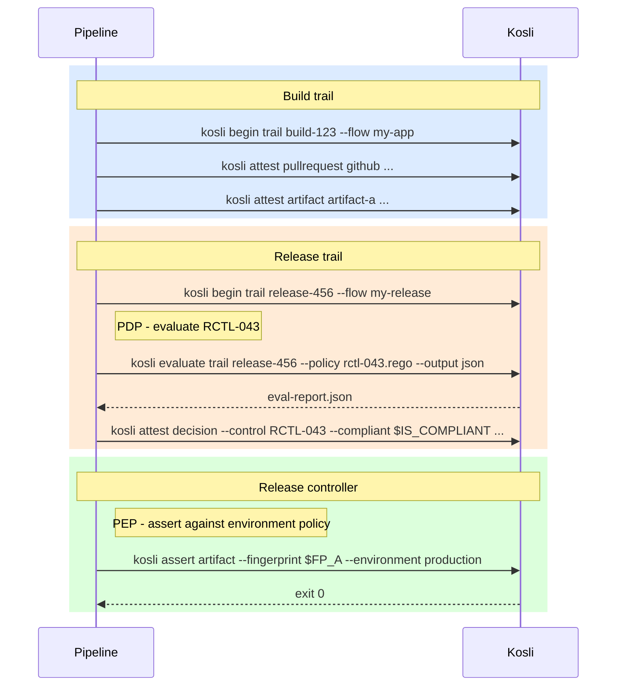

import { ConceptBanner } from '/snippets/kosli-next-banner.mdx';

<ConceptBanner />

## The problem

Today, Kosli can tell you _that_ an attestation was made on a trail, but not _which governance requirement it satisfies_. Auditors, compliance teams, and governance engineers think in terms of named controls - "source code review", "no hard-coded credentials", "vulnerability scan passed" - and they want to answer questions like:

- Which of our controls have evidence recorded against them, and which don't?
- For this release, which controls passed and which failed?
- How much of our production estate is covered by control `RCTL-1866`?

Right now, those questions are hard to answer in Kosli without bespoke reporting on top of raw attestations.

## The proposed approach

We are considering adding **controls** as first-class entities in Kosli. A control would be a stable, named governance requirement - mirrored from your existing controls catalog in ServiceNow, a GRC system, or a policy document. Pipelines would record **decisions** against controls, and environment policies would reference controls by identifier.

Three new building blocks would sit alongside the existing data model:

- **Raw fact attestations** (unchanged) are the evidence you collect in pipelines: test results, vulnerability scans, pull request approvals.
- **Decisions** are recorded outcomes of a Policy Decision Point (PDP) - the moment a judgement is reached about a specific control for a specific artifact. A decision would be an attestation that references a control.
- **Controls** are the named governance requirements that decisions are recorded against. They would have a stable identifier, a human-readable name, and an optional description and source URL pointing back to the authoritative definition.

Raw facts would continue to exist independently of controls. A JUnit report is a fact. Whether it satisfies a "test coverage" control would be a decision. The decision references the fact; the fact would not need to know about the control.

Kosli would hold a mirror to your existing control definitions - it would not replace your GRC system. The catalog in Kosli would be a lightweight copy that enables querying and coverage visibility.

## How it would work

The walkthrough below is **illustrative**. CLI flags, YAML schema, and UI shown here are sketches to make the proposal concrete - they are not implemented and the shapes will change based on feedback.

### Defining a control

A control would be created from the Kosli app or the CLI, mirroring an entry in your existing catalog:

```bash
kosli create control \
    --identifier RCTL-043 \
    --name "Source code review" \
    --description "All commits included in a release must have been reviewed by at least one person other than the author." \
    --source-url https://your-grc-system.example.com/controls/RCTL-043
```

The **identifier** would be the stable identity (immutable once created); name, description, and source URL would be mutable and versioned, so the audit trail stays precise as controls evolve.

The catalog view would surface a **coverage indicator** per control:

| Status | Meaning |
|--------|---------|
| **Active** | A passing decision has been recorded within the last 28 days. |
| **Stale** | Decisions in the past, but none in the last 28 days - pipelines may have stopped recording against this control. |
| **No decisions** | Defined in the catalog, but no decision ever recorded. A dark control. |

<Frame>
  
</Frame>

### Recording a decision

A decision would record the outcome of a PDP against a named control, scoped to a specific artifact:

```bash
kosli attest decision \
    --flow my-release-flow \
    --trail my-release-trail \
    --fingerprint "$ARTIFACT_FINGERPRINT" \
    --control RCTL-043 \
    --compliant true \
    --name "source-code-review-decision" \
    --description "All 14 commits in this release have been reviewed by a second developer."
```

The decision attestation would land on a trail like any other attestation and affect trail compliance. The PDP itself - whether you run `kosli evaluate` with a Rego policy, a bespoke script, or a third-party tool - would remain entirely yours. `kosli attest decision` would record the outcome; it would not make the decision for you.

A natural pairing is `kosli evaluate`, which already runs Rego policies against trail evidence. Its JSON output could be captured and recorded as the decision, with the policy and report attached as evidence:

```bash
kosli evaluate trail "$TRAIL_NAME" \
    --policy supply-chain-policy.rego \
    --org "$KOSLI_ORG" \
    --flow "$FLOW_NAME" \
    --output json > eval-report.json

is_compliant=$(jq -r '.allow' eval-report.json)

kosli attest decision \
    --flow "$FLOW_NAME" \
    --trail "$TRAIL_NAME" \
    --fingerprint "$ARTIFACT_FINGERPRINT" \
    --control RCTL-1866 \
    --compliant="$is_compliant" \
    --name supply-chain-integrity-decision \
    --attachments supply-chain-policy.rego,eval-report.json
```

### Referencing controls in environment policies

Environment policies would gain a `controls` key. Instead of expressing requirements in tooling-specific terms ("has a Snyk attestation with zero criticals"), the policy would express the governance outcome ("control `RCTL-1866` has been satisfied"). The decision attestation would carry the evidence of how that judgement was reached.

```yaml prod-policy.yaml
_schema: https://docs.kosli.com/schemas/policy/v1
artifacts:
  provenance:
    required: true
  controls:
    - RCTL-043
    - RCTL-1866
```

An artifact deployed to this environment would be marked non-compliant if a passing decision is missing for any listed control. The Policy Enforcement Point (PEP) would be `kosli assert artifact --environment`, used in a pipeline step to gate promotion on control compliance.

### The end-to-end flow

The sequence below shows how a single artifact would move through a build trail and a release trail, with the decision made at release time and enforced when the release controller checks the environment policy.



### Viewing compliance

A per-control detail view would show three perspectives:

**Decisions** - every decision attestation recorded against this control, with artifact, flow, trail, environment, recorded-by, date, outcome, and which version of the control definition was in effect.

<Frame>
  
</Frame>

**Deployments** - where artifacts with decisions against this control have been deployed, with compliant/non-compliant status per deployment.

<Frame>
  
</Frame>

**Coverage** - the ratio of deployments where a decision was recorded vs. those where it was not. Controls without decisions would be the blind spots auditors will ask about.

<Frame>
  
</Frame>

## Open questions

We would love feedback on:

- **Identifier conventions.** Should Kosli enforce a format for control identifiers, or accept whatever your GRC system uses (`RCTL-043`, `peer-review`, `vuln-scan-production`)?
- **Catalog sync.** Should Kosli pull from your GRC system, or is a one-way mirror managed via CLI/API enough?
- **Versioning behavior.** Decisions would reference the control version current at decision time. Is that the right default, or should the latest version always win for reporting?
- **Coverage windows.** "Active" within 28 days - is that the right window, or should it be configurable per control?
- **Policy gating.** Should missing decisions block deployments by default, or only when explicitly asserted via `kosli assert`?

Tell us what you think - email [support@kosli.com](mailto:support@kosli.com).
