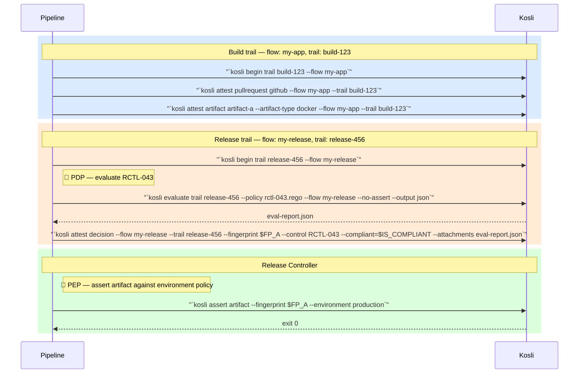

<Info>
**This feature is in beta.** Controls, decisions, the `kosli attest decision` command, and the `for_control` policy requirement are all available in Kosli but in beta — the UI, CLI flags, and policy YAML schema may still change. It is rolled out per organization, so reach out to the Kosli team to enable it for yours, or with any questions and comments.
</Info>

Controls in Kosli represent the named, identifiable governance requirements that your organization enforces across software delivery — things like "source code review", "no hard-coded credentials", or "vulnerability scan passed". They are the things auditors ask about, the things compliance teams track, and the things governance platform engineers build automation around.

Without controls as first-class entities, Kosli can tell you _that_ an attestation was made, but not _which governance requirement it satisfies_. Controls close that gap: they connect the evidence you collect in pipelines to the specific requirements that auditors, control owners, and regulators care about.

This tutorial covers how to:

- Define a control library in Kosli that mirrors your existing controls catalog
- Record decision outcomes against controls from your pipelines
- Reference controls in environment policies
- Review the decisions and version history of each control

## Prerequisites

- [Install Kosli CLI](/getting_started/install).
- [Get a Kosli API token](/getting_started/service-accounts).
- Have at least one [Flow](/getting_started/flows) and [Trail](/getting_started/trails) already created.

## Setup

```bash
export KOSLI_ORG=<your-org>
export KOSLI_API_TOKEN=<your-api-token>
```

## Understanding controls

Before creating controls, it helps to understand how they fit into the Kosli data model.

**Raw fact attestations** are the evidence you collect in pipelines — test results, vulnerability scans, pull request approvals. These are facts about what happened.

**Decisions** are the recorded outcomes of a Policy Decision Point (PDP) — the step in your process where a judgment is reached about a specific control: "control `RCTL-043` is satisfied for this artifact." A decision is an attestation that references a control, recorded at the point where the judgment is made — typically during a release or promotion step.

**Controls** are the named governance requirements that decisions are recorded against. They have a stable identity (the control identifier), a human-readable name, and an optional description and links pointing back to your GRC system or policy document.

This separation matters: raw facts exist independently of controls. A JUnit test report is a fact. Whether that test report satisfies a "test coverage" control is a decision. The decision references the fact; the fact doesn't need to know about the control.

A Policy Enforcement Point (PEP) is where that decision is acted upon. `kosli assert artifact --environment` is the PEP — it checks that an artifact satisfies all requirements in the environment's policy, including any listed controls, and exits non-zero if it doesn't. Place it at the point in your pipeline where you want to gate progress on control compliance.

<Info>
  Kosli holds a mirror to your existing control definitions — it does not replace your GRC system or ServiceNow instance. The control catalog in Kosli is a lightweight copy that enables querying and reporting.
</Info>

## Creating a control

Navigate to **Controls** in the [Kosli app](https://app.kosli.com) sidebar and select **New control**. A control has the following fields:

| Field | Description |
|-------|-------------|
| **Identifier** | **Required.** The control identifier (e.g. `RCTL-043`, `peer-review`, `vuln-scan-production`). Unique within your organization and **immutable once created** — to use a different identifier, create a new control. |
| **Name** | **Required.** A human-readable label for the control (e.g. `Source code review`). You can rename a control while keeping the same identifier. |
| **Description** | Optional. What the control does, in human-readable terms. |
| **Links** | Optional. One or more named URLs pointing back to the authoritative definition in your GRC system, ServiceNow, or policy document. |

Only org admins can create or edit controls. **Tags** are added separately, from a control's detail page after it exists — they're not part of the create form and don't create a new version. Controls can also be managed programmatically through the controls API (`POST /api/v2/controls/{org}`).

<Tip>
  Control identifiers are the stable identity that decisions and environment policies reference. Choose identifiers that match how your organization already refers to controls — for example, the identifiers in your ServiceNow or GRC system. If you use `RCTL-043` today, use exactly that.
</Tip>

### List your controls

Navigate to **Controls** in the [Kosli app](https://app.kosli.com) sidebar to browse your full controls catalog. Search by name or identifier, and filter by tag to narrow the list. Each control shows its identifier, description, tags, name, and current version.

Control definitions are versioned: each time you update a control's name, description, or links, a new version is created. This matters for audits — decisions recorded against a control always reference the exact version of the definition that was current when the decision was made, so the audit trail is precise even as controls evolve over time. A control's full version history is available on its **Versions** tab.

<Frame>
  
</Frame>

You can also list controls through the controls API (`GET /api/v2/controls/{org}`).

## Recording a decision against a control

A decision records the outcome of a PDP against a named control, scoped to a specific artifact. Use `--fingerprint` to identify the artifact the decision applies to — this is what allows `kosli assert artifact --environment` to later check that all required controls have passing decisions for that artifact specifically.

```bash
kosli attest decision \
    --flow my-release-flow \
    --trail my-release-trail \
    --fingerprint "$ARTIFACT_FINGERPRINT" \
    --control RCTL-043 \
    --compliant=true \
    --name "source-code-review-decision" \
    --description "All 14 commits in this release have been reviewed by a second developer."
```

| Flag | Description |
|------|-------------|
| `--control` | **Required.** The control identifier this decision is recorded against. |
| `--compliant` | **Required.** Whether the control is satisfied. Boolean flag — pass `--compliant=true` or `--compliant=false`. |
| `--fingerprint` | The SHA256 fingerprint of the artifact this decision applies to. Scope decisions to an artifact so that assertions and environment policies can check compliance for that artifact specifically. Omit to record a trail-scoped decision instead. |
| `--artifact-type` | The artifact type (e.g. `docker`, `file`). Provide this with the artifact name/path as the command argument instead of `--fingerprint` to have Kosli calculate the fingerprint. |
| `--name` | The attestation slot name on the trail. |
| `--description` | Optional human-readable context for the decision. |
| `--attachments` | Optional evidence file(s) to attach (e.g. an evaluation report, a REGO policy output). |
| `--user-data` | Optional path to a JSON file containing additional structured data to attach to the attestation. |

The decision attestation goes on a trail, like any other attestation. It affects trail compliance: a `--compliant=false` decision makes the trail non-compliant. There are no restrictions on which flow or trail a decision can be recorded on — place it wherever makes sense in your process, typically at the point where the decision is actually being made (e.g. during a release preparation or promotion step). You can record multiple decisions for the same control on a trail; the most recent one is used when evaluating compliance. The control identifier doesn't need to exist in your catalog when you record a decision — it's matched up at compliance-evaluation time.

<Info>
  A decision records the outcome of a PDP. How the PDP is implemented — running `kosli evaluate`, executing a custom script, or using a third-party tool — is up to you. `kosli attest decision` records the outcome; it does not make the decision for you.
</Info>

### Attaching evidence to a decision

Evidence attached to a decision explains _why_ the decision was reached — not just that a control passed or failed, but what information was used to make that judgment. This is what auditors will ask for: the policy that was applied and the evaluation report that justified the outcome.

A natural source of evidence is a `kosli evaluate` report. `kosli evaluate` is a PDP: it runs a Rego policy against a trail's evidence and writes the allow/deny result to its output. By default it also asserts — exiting non-zero when the policy denies — so pass `--no-assert` when you want to capture the result and record it as a decision yourself rather than failing the step. The example below evaluates a trail, captures the full JSON report, reads the result, and records it as a decision. See [Evaluate trails with OPA policies](/tutorials/evaluate_trails_with_opa) for a full walkthrough of `kosli evaluate`.

```bash
# Run the evaluation and save the full JSON report.
# --no-assert makes kosli evaluate exit 0 even when the policy denies,
# so the pipeline can read the result from the JSON output itself.
kosli evaluate trail "$TRAIL_NAME" \
    --policy supply-chain-policy.rego \
    --flow "$FLOW_NAME" \
    --no-assert \
    --output json > eval-report.json

# Read the allow/deny result from the report
is_compliant=$(jq -r '.allow' eval-report.json)

# Extract violations as structured user-data
jq '{violations: .violations}' eval-report.json > eval-violations.json

# Record the decision, attaching the policy and evaluation report as evidence
kosli attest decision \
    --flow "$FLOW_NAME" \
    --trail "$TRAIL_NAME" \
    --fingerprint "$ARTIFACT_FINGERPRINT" \
    --control RCTL-1866 \
    --compliant="$is_compliant" \
    --name supply-chain-integrity-decision \
    --attachments supply-chain-policy.rego,eval-report.json \
    --user-data eval-violations.json
```

This creates a decision attestation with:
- **`--attachments`** containing the Rego policy (for reproducibility) and the full JSON evaluation report
- **`--user-data`** containing the violations, which appear in the Kosli UI as structured metadata on the attestation
- **`--compliant`** set directly from the evaluation result

## Asserting artifact compliance

`kosli assert artifact --environment` is the Policy Enforcement Point (PEP). It checks that an artifact satisfies all requirements in the environment's attached policy — including any controls required via `for_control` rules — and exits non-zero if it doesn't. Use it as a pipeline gate before promoting an artifact to an environment.

```bash
kosli assert artifact \
    --fingerprint "$ARTIFACT_FINGERPRINT" \
    --environment production
```

| Flag | Description |
|------|-------------|
| `--fingerprint` | The SHA256 fingerprint of the artifact to assert. |
| `--artifact-type` | The artifact type (e.g. `docker`, `file`). Provide this with the artifact name/path as the command argument instead of `--fingerprint` to have Kosli calculate the fingerprint. |
| `--environment` | **Required.** The Kosli environment whose attached policy the artifact is asserted against. |

If the artifact satisfies all policy requirements — including passing decisions for every listed control — the command exits 0. If not, the command exits non-zero and prints which requirements were not met, failing the pipeline step.

<Tip>
  `kosli attest decision` is the PDP: it records a judgment about a control. `kosli assert artifact --environment` is the PEP: it enforces that judgment as part of the environment policy. Keep them in separate pipeline steps — the PDP step is where evidence is evaluated and the outcome is recorded; the PEP step is where the pipeline gates on that recorded outcome.
</Tip>

## End-to-end pipeline flow

The sequence below shows a single artifact moving through a build trail and a release trail, with the compliance decision made at release time and enforced by the release controller checking the environment policy.



## Referencing controls in environment policies

Environment policies define the requirements an artifact must satisfy before it can run in a given environment. You can require that specific named controls have a passing decision recorded — not just that the trail is generally compliant. This is the key distinction: rather than relying on trail compliance as a catch-all, you can make individual controls explicit policy gates.

```yaml prod-policy.yaml
_schema: https://docs.kosli.com/schemas/policy/v1
artifacts:
  provenance:
    required: true
  attestations:
    - type: decision
      for_control: RCTL-043
    - type: decision
      for_control: RCTL-1866
```

Each `attestations` rule with `type: decision` and a `for_control` identifier requires a compliant decision recorded for that control. The control must already exist in your organization — unlike recording a decision, a policy that references an unknown control identifier is rejected. With this policy in place, an artifact deployed to this environment will be marked **non-compliant** if a passing decision has not been recorded for each listed control on its trail. The artifact can still be deployed — Kosli records compliance state but does not block deployments by default. To gate deployments on compliance, use [`kosli assert`](/getting_started/enforce_policies) in your pipeline. This abstracts the policy from the specific tooling your pipelines use: instead of "has an attestation of type `snyk` with zero criticals", the policy expresses "control `RCTL-1866` has been satisfied" — and the decision attestation carries the evidence of how that judgment was reached.

For the complete policy syntax, including attestation requirements and exceptions, see the [Environment Policies](/getting_started/policies) page.

## Viewing a control

Navigate to **Controls** in the [Kosli app](https://app.kosli.com) and select a control to see its detail view. The header shows the identifier, current version, name, any links, description, and tags. Below it are two tabs: **Decisions** and **Versions**.

### Decisions

The Decisions tab is the default view. It lists every decision recorded against this control across all flows and trails, with the timestamp, the trail it was recorded on, the artifact fingerprint, and the outcome (compliant or non-compliant). Filter by outcome and date range to narrow the list.

<Frame>
  
</Frame>

Select a decision to open its detail, showing the trail and artifact it applies to, the origin URL, the user-data behind the judgment (such as the Rego evaluation result and the parameters it was run with), and any attached evidence files (such as the Rego policy).

<Frame>
  
</Frame>

### Versions

The Versions tab lists every version of the control definition — the name, description, and links as they were at each version, with who made the change and when. Because every decision references the control version that was current when it was recorded, this history lets auditors see exactly what the control required at the time of each decision.

## What you've accomplished

You have learned how to define controls in Kosli, record decisions against them from pipelines using `kosli attest decision` as the PDP, require controls in environment policies with `for_control`, assert artifact compliance using `kosli assert artifact --environment` as the PEP, and review the decisions and version history of each control.

Your controls catalog is now the bridge between the evidence Kosli collects and the requirements your auditors, control owners, and regulators care about. For each production change, you can now answer: "which of our controls have a compliant decision recorded, and which don't?"

From here you can:

- Learn more about [controls](/understand_kosli/controls)
- Learn more about [environment policies](/getting_started/policies)
- Learn more about [attestations](/getting_started/attestations)
- [Evaluate trails with Rego policies](/tutorials/evaluate_trails_with_opa) to automate decision-making
